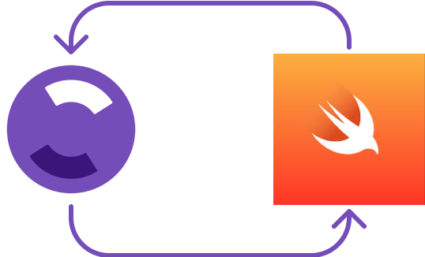
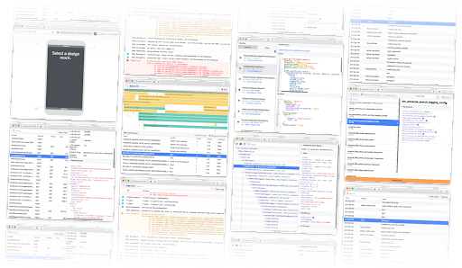

# FlipperLite

  

## What is FlipperLite?
FlipperLite is a new Swift package that exposes a Flipper client to your iOS | MacOS applications that allow you to easily develop new or reuse existing Flipper plugins.

It gives you all that the official Flipper SDK provides and also has lesser and lightweight dependencies as compared to the official SDK. This SDK doesn’t depend on boost, glog, folly etc and so it's quite light weight relatively. 

This repository has a bunch of example applications that you can play with to understand how to write a Flipper plugin, how to send/listen to events, and how the end-to-end integration works. (UserDefaults Plugin, Network Plugin, Custom Logger Plugin, Notifications plugin, Tic-Tac-Toe to demonstrate bi-directional communication etc.)

## Why FlipperLite?

  

[swift-flipper](https://github.com/chiragramani/SwiftFlipper) basically has most of the core changes in Swift, as required by the official Flipper documentation. The idea was to extend the swift-flipper SDK to get secure device connectivity in the same way as the official Flipper SDK does, so that all the limitations of swift-flipper are addressed and that too with a significantly reduced dependency set as compared to the official SDK. Hence, FlipperLite was created.

We get full support of device specific functionality. (screenshot, video recording from the Flipper IDE, Logs Plugin etc.)
Connection via simulator or via USB connected device is totally transparent to the developers.

## Troubleshooting iOS Issues
General: https://fbflipper.com/docs/getting-started/troubleshooting/general/

Source: https://fbflipper.com/docs/getting-started/troubleshooting/ios/

### iOS device not showing up​
Make sure [idb](https://fbidb.io/docs/installation) is installed and configured in the Flipper settings.

### iOS simulator device not showing up​
Ensure that your simulator is on the same version as selected in xcode-select. You can do that by checking that commands ps aux | grep CoreSimulator and xcode-select -p shows the same Xcode version. If not, update the xcode version by sudo xcode-select --switch <Path to xcode>

### iOS app connection error "Connection failed. Failed to find device..."​
If during connecting the iOS app to Flipper you see an error message "Connection failed. Failed to find device <device_id> while trying to connect app" - try executing idb kill on a terminal and restarting Flipper as a workaround to reset idb state.

## Known issues
Please note: this package is only covering the client SDK pieces so all IDE related issues should be reported in the official flipper github forums.
 
Apple Silicon Flipper IDE is not a universal binary and is translated via Rosetta. This is being tracked in https://github.com/facebook/flipper/pull/3553.
NSLog from a Swift application are not shown in the Logs plugin. This is being tracked in https://github.com/facebook/flipper/issues/3823. 

## If you are interested to know more about Flipper, the following should help:

1. https://fbflipper.com/
2. https://engineering.fb.com/2018/06/11/android/flipper/ 
3. https://fbflipper.com/blog/2022/02/21/js-flipper-announcement/
4. Mobile@Scale Tel Aviv – Flipper: An extensible mobile app debugger - https://www.facebook.com/atscaleevents/videos/mobilescale-tel-aviv-flipper-an-extensible-mobile-app-debugger/2210661825632394/ 
5. [Flipper and JS: why we added JavaScript support to a mobile debugging platform](https://developers.facebook.com/blog/post/2022/08/25/flipper-and-js-why-we-added-javascript-support-to-a-mobile-debugging-platform/)
6. https://www.youtube.com/watch?v=WCs09c1B1Lk 
7. Flipper: The Extensible DevTool Platform for React Native - Michel Weststrate aka @mweststrate - https://www.youtube.com/watch?v=WltZTn3ODW4
